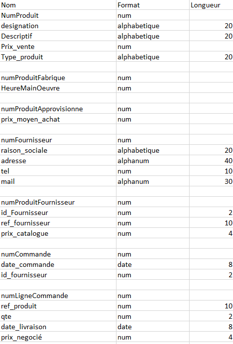
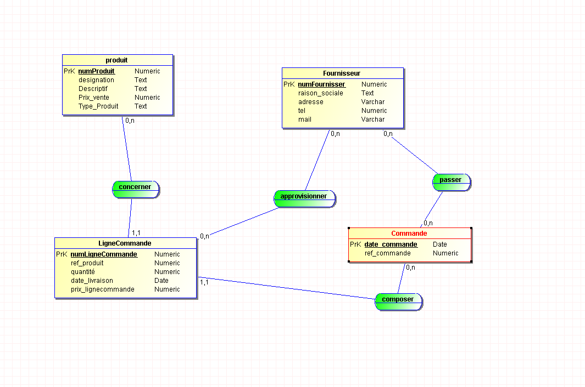
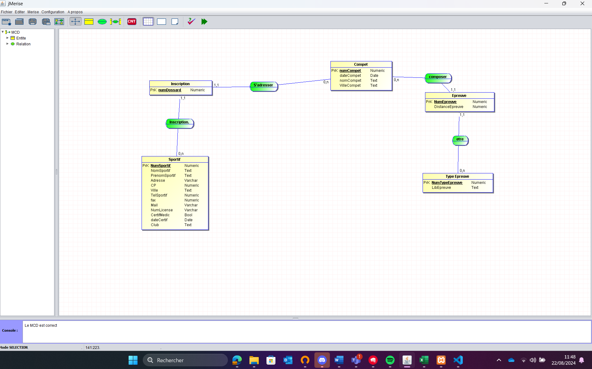

# EXAMEN 

## SUJET 1  

```
L’entreprise XProd fabrique et commercialise divers produits. Ils sont identifiés par une référence propre à XProd et on enregistre une désignation (libellé court), un descriptif (libellé long) et un prix de vente catalogue unitaire hors taxes.
Dans la base de données, elle gère deux types de produits :
les produits qu’elle fabrique pour lesquels on enregistre le nombre moyen d’heures de main d’œuvre nécessaires à leur fabrication.
les produits dits « approvisionnés » parce qu’elle ne les fabrique pas : ils sont achetés à un ou plusieurs fournisseurs à un prix d’achat unitaire moyen.

Pour ne pas dépendre d’un fournisseur, enregistré par ses raison sociale, adresse, etc., pour chaque produit approvisionné l’entreprise a établi une liste de fournisseurs capables de livrer ce produit. Bien entendu, pour un même produit, chaque fournisseur peut avoir sa propre référence et un prix différent.
Lorsque XProd passe une commande à une certaine date à un fournisseur, elle essaie de grouper plusieurs lignes de commande : une par produit dans une certaine quantité avec sa date de livraison prévue, pour réduire les frais de livraison de la commande et essayer de négocier un prix d’achat unitaire inférieur au prix catalogue du fournisseur.
```

### 🖊️ Travail a faire :  
 - Créer le dictionnaire de données.
- Créer le Modèle Conceptuel des Données.
- Concevoir le Modèle Logique des Données.
- Concevoir le modèle physique des données.
### Voici le dictionnaire de données : 



### Voici mon Modèle Conceptuel des Données (MDC) : 


### Voici mon Modèle Logique des Données (MLD) et le relationnelle 


produit (  #numProduit,   designation,   Descriptif,   Prix_vente,   Type_Produit  )

Fournisseur (  #numFournisser,   raison_sociale,   adresse,   tel,   mail,   numLigneCommande_LigneCommande  )

Commande (  #date_commande,   ref_commande,   numFournisser_Fournisseur  )

LigneCommande (  #numLigneCommande,   ref_produit,   quantité,   date_livraison,   prix_lignecommande,   date_commande_Commande,   numProduit_produit  )


### Voici le script SQL 

Ce script fonctionne.

```sql
CREATE TABLE produit(
    numProduit        Numeric(2),
    designation       Text(20),
    Descriptif        Text(20),
    Prix_vente        Numeric(4),
    Type_Produit      Text(20),
    PRIMARY KEY (numProduit)
) ENGINE=InnoDB;

CREATE TABLE Fournisseur(
    numFournisser     Numeric(2),
    raison_sociale    Text(20),
    adresse           Varchar(40),
    tel               Numeric(10),
    mail              Varchar(30),
    numLigneCommande_LigneCommande Numeric,
    PRIMARY KEY (numFournisser)
) ENGINE=InnoDB;

CREATE TABLE Commande(
    date_commande     Date,
    ref_commande      Numeric,
    numFournisser_Fournisseur Numeric(2),
    PRIMARY KEY (date_commande)
) ENGINE=InnoDB;

CREATE TABLE LigneCommande(
    numLigneCommande      Numeric,
    ref_produit           Numeric(10),
    quantité              Numeric(2),
    date_livraison        Date,
    prix_lignecommande    Numeric(4),
    date_commande_Commande Date,
    numProduit_produit    Numeric(2),
    PRIMARY KEY (numLigneCommande)
) ENGINE=InnoDB;

ALTER TABLE Fournisseur 
ADD CONSTRAINT FK_Fournisseur_numLigneCommande_LigneCommande 
FOREIGN KEY (numLigneCommande_LigneCommande) 
REFERENCES LigneCommande(numLigneCommande);

ALTER TABLE Commande 
ADD CONSTRAINT FK_Commande_numFournisser_Fournisseur 
FOREIGN KEY (numFournisser_Fournisseur) 
REFERENCES Fournisseur(numFournisser);

ALTER TABLE LigneCommande 
ADD CONSTRAINT FK_LigneCommande_date_commande_Commande 
FOREIGN KEY (date_commande_Commande) 
REFERENCES Commande(date_commande);

ALTER TABLE LigneCommande 
ADD CONSTRAINT FK_LigneCommande_numProduit_produit 
FOREIGN KEY (numProduit_produit) 
REFERENCES produit(numProduit);
```

Si nous voulons chercher un produit dans la table produit avec la requete sql : 
```sql
SELECT * FROM produit WHERE designation = 'test' AND Prix_vente <= 50;
```

# SUJET 2
 ```
 Les fédérations de sport proposant des compétitions composées de plusieurs sports ou épreuves, comme le biathlon, triathlon et autre décathlon vous ont demandé d’analyser et de développer un logiciel générique pouvant gérer l’organisation de leurs compétitions. Voici quelques éléments vous permettant de commencer l’analyse.
Les sportifs s’inscrivent à une compétition. Lors de cette inscription on enregistre son nom, son prénom, son adresse et ses coordonnées téléphoniques, fax et e-mail. Il se voit attribuer un numéro de dossard dans cette compétition, qui servira aussi à retrouver son dossier d’inscription.
Attention : un sportif peut être licencié à la fédération via un club ou pas, les amateurs sont parfois autorisés à concourir. C’est pourquoi pour un sportif licencié on enregistre bien sûr son numéro de licence et son club, tandis que pour un sportif amateur on exigera seulement un certificat médical daté de moins de trois mois délivré par un médecin du sport pour des questions d’assurance. 
Une compétition a lieu à une certaine date dans une certaine ville et porte éventuellement un libellé comme « Grand prix de printemps ». Chaque compétition est composée d’un certain nombre d’épreuves effectuées dans un certain ordre : pour certaines compétitions il y a d’abord une épreuve de 3 km de natation suivi de 50 km à bicyclette et enfin 20 km de course à pied ; pour d’autres cela commencera par une escalade d’un mur de niveau 3, continuera par une randonnée pédestre de 10 km et se terminera par un parcours en traîneau tiré par des chiens… Bref, chaque épreuve est d’un certain type et il faut spécifier alors sa distance et les conditions de réalisation.
 ```

### 🖊️ Travail a faire :  
 - Créer le dictionnaire de données.
- Créer le Modèle Conceptuel des Données.
- Concevoir le Modèle Logique des Données.
- Concevoir le modèle physique des données.

Voici mon dictionnaire de donées : 


### Voici mon Modèle Conceptuel des Données (MDC) : 




### Voici mon Modèle Logique des Données (MLD) et le relationnelle : 

Sportif (  #NumSportif,   NomSportif,   PrenomSportif,   Adresse,   CP,   Ville,   TelSportif,   fax,   Mail,   NumLicense,   CertifMedic,   dateCertif,   Club  )

Compet (  #numCompet,   dateCompet,   nomCompet,   VilleCompet  )

Epreuve (  #NumEpreuve,   DistanceEpreuve,   numCompet_Compet,   NumTypeEpreuve_Type Epreuve  )

Type Epreuve (  #NumTypeEpreuve,   LibEpreuve  )

Inscription (  #numDossard,   NumSportif_Sportif,   numCompet_Compet  )

### Voici mon script sql : 

Ce script fonctionne.

```sql
CREATE TABLE Sportif (
    NumSportif       Numeric(2) UNSIGNED,
    NomSportif       VARCHAR(20),
    PrenomSportif    VARCHAR(20),
    Adresse          VARCHAR(30),
    CP               Numeric(5) UNSIGNED,
    Ville            VARCHAR(15),
    TelSportif       VARCHAR(10),
    Fax              VARCHAR(10),
    Mail             VARCHAR(30),
    NumLicense       VARCHAR(10),
    CertifMedic      BOOLEAN,
    DateCertif       DATE,
    Club             VARCHAR(10),
    PRIMARY KEY (NumSportif)
) ENGINE=InnoDB;

CREATE TABLE Compet (
    NumCompet       Numeric(2) UNSIGNED,
    DateCompet      DATE,
    NomCompet       VARCHAR(10),
    VilleCompet     VARCHAR(10),
    PRIMARY KEY (NumCompet)
) ENGINE=InnoDB;

CREATE TABLE TypeEpreuve (
    NumTypeEpreuve   Numeric(2) UNSIGNED,
    LibEpreuve       VARCHAR(15),
    PRIMARY KEY (NumTypeEpreuve)
) ENGINE=InnoDB;

CREATE TABLE Epreuve (
    NumEpreuve                Numeric(2) UNSIGNED,
    DistanceEpreuve           Numeric(2) UNSIGNED,
    NumCompet_Compet          Numeric(2) UNSIGNED,
    NumTypeEpreuve_TypeEpreuve Numeric(2) UNSIGNED,
    PRIMARY KEY (NumEpreuve),
    FOREIGN KEY (NumCompet_Compet) REFERENCES Compet(NumCompet) ON DELETE CASCADE ON UPDATE CASCADE,
    FOREIGN KEY (NumTypeEpreuve_TypeEpreuve) REFERENCES TypeEpreuve(NumTypeEpreuve) ON DELETE CASCADE ON UPDATE CASCADE
) ENGINE=InnoDB;

CREATE TABLE Inscription (
    NumDossard         Numeric(4) UNSIGNED,
    NumSportif_Sportif Numeric(2) UNSIGNED,
    NumCompet_Compet   Numeric(2) UNSIGNED,
    PRIMARY KEY (NumDossard),
    FOREIGN KEY (NumSportif_Sportif) REFERENCES Sportif(NumSportif) ON DELETE CASCADE ON UPDATE CASCADE,
    FOREIGN KEY (NumCompet_Compet) REFERENCES Compet(NumCompet) ON DELETE CASCADE ON UPDATE CASCADE
) ENGINE=InnoDB;
```

Pour verifier si mon script sql fonctionne bien, j'ai créer un sportif dans le sql te j'ai fait un select pour chercher qui etait au numero 1

```sql
SELECT * FROM Sportif WHERE NumSportif = 1;
```